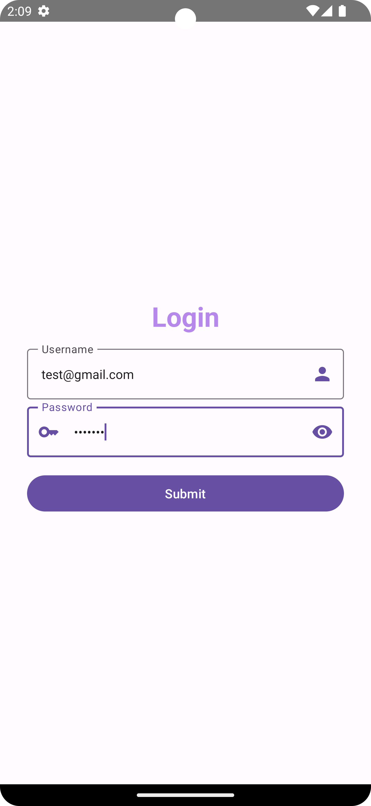
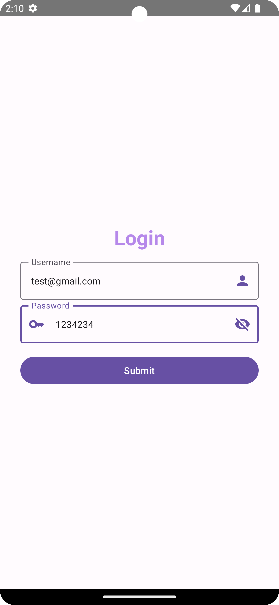

# Jetpack Compose Login Form

This is a basic example of a login form created using Jetpack Compose for Android. It includes text fields for username and password, and a submit button.

## Prerequisites

- Android Studio with Jetpack Compose support.

## Getting Started

1. Clone the repository:

   ```bash
   git clone https://github.com/yourusername/your-repo.git
   ```

2. Open the project in Android Studio.

3. Run the app on an emulator or a physical device.

## Overview
!()[Screenshot_20240201_140909.png]

The login form is implemented using Jetpack Compose, a modern Android UI toolkit that simplifies UI development.

### Components

- **LoginForm:** The main screen that includes a title, username, password fields, and a submit button.

- **LoginField:** A Composable function for the username text field.

- **PasswordField:** A Composable function for the password text field.

- **SubmitButton:** A Composable function for the submit button.

### Styling

The UI elements are styled using Material Theme with custom modifications. You can customize the styles based on your design preferences.

## Usage

Feel free to use this code as a starting point for your own login forms. You can modify and extend it to fit your specific requirements.

## License

This project is licensed under the [MIT License](LICENSE).
